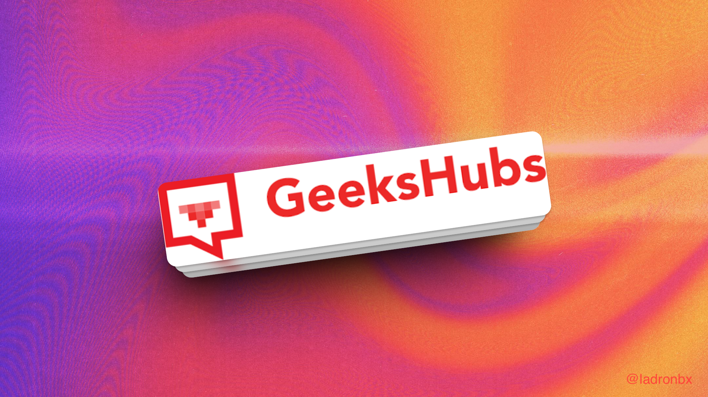
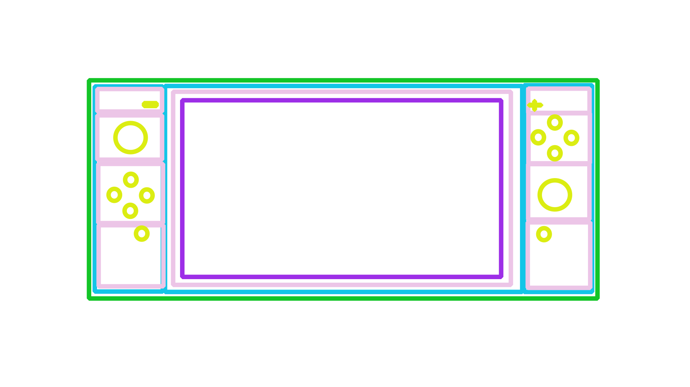
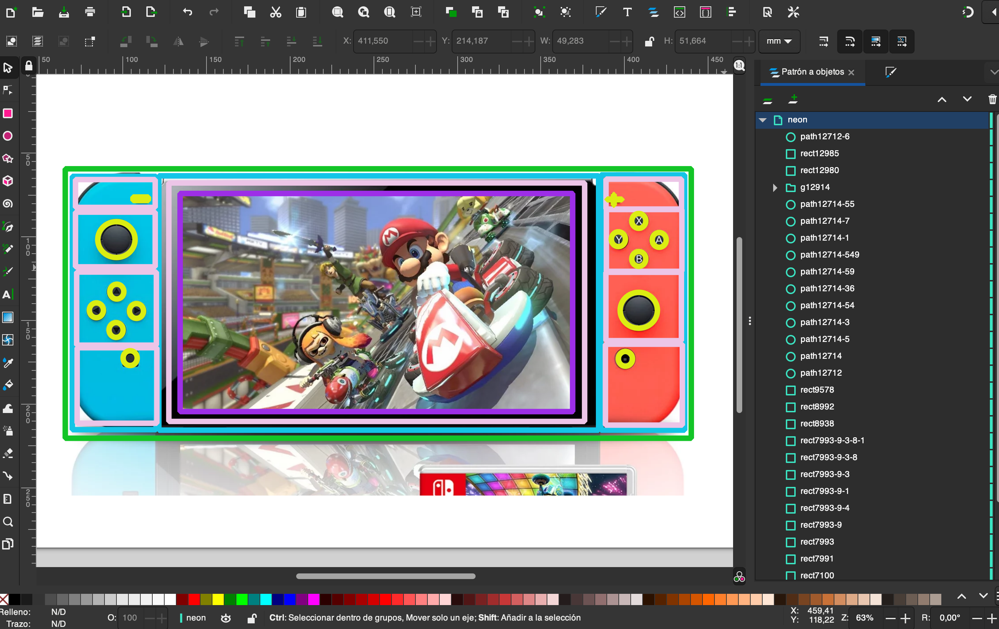
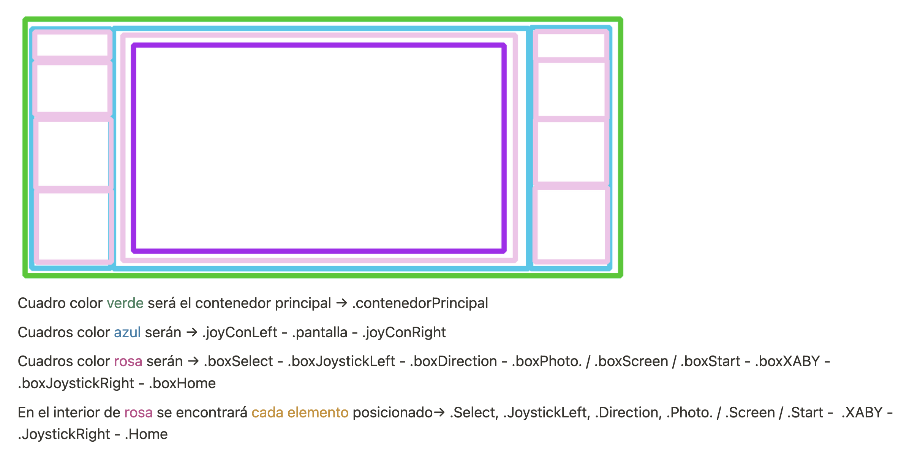
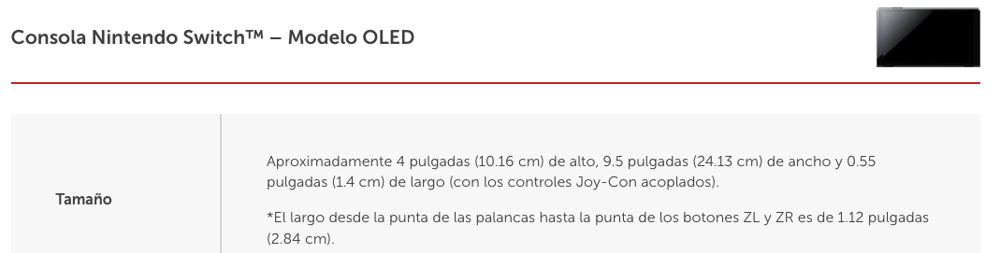
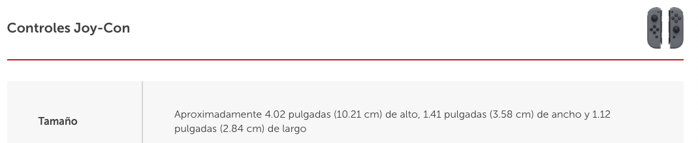

---

#  Nintendo Switch Oled Interactiva
🎮 [Nintendo Switch Oled - Interactiva](https://github.com/ladronbx/nintendo-switch-interactiva.git) 🎮

**Segundo proyecto del Bootcamp Full Stack Developer Presencial en la academia GeeksHubs en Valencia**

Durante este proyecto, he aplicado los conocimientos adquiridos en la primera y segunda semana del Bootcamp, para crear una página web que representa a una consola **Nintendo Switch Oled** la cual es **interactiva**

---

## Índice

- 🛠️ [Tecnologías utilizadas](#tecnologías-utilizadas) 
- 📱 [Media Query](#media-query)
- 🧩 [Código Fuente](#código-fuente)
(#carta-sushi-y-carta-vino)
- 📋 [Instrucciones de Uso](#instrucciones-de-uso)
- 🤝 [Contribuciones](#contribuciones)
- 📧 [Contacto](#contacto)
- 🌐 [Enlace Github Pages](#enlace-github-pages)

## Tecnologías utilizadas:

  

# ¿Cómo se ha hecho?
### Planificación del diseño

He usado el programa **Inkscape** para poder desarrollar una idea general de cómo idear y esbozar el diseño inicial del proyecto.

Después de analizar y planificar cuántos contenedores eran necesarios para mi diseño, procedí a asignar una clase específica a cada uno de ellos. Estas clases fueron nombradas de manera deliberada, buscando la claridad y concisión en sus denominaciones. Esta acción fue fundamental para facilitar mi trabajo tanto en el código HTML como en el CSS.

La asignación de estas clases descriptivas tenía como objetivo principal organizar de manera efectiva la estructura de mi proyecto. Al utilizar nombres claros y concisos, pude identificar y seleccionar fácilmente los elementos en el código, lo que a su vez mejoró la legibilidad y mantenibilidad de mi proyecto.

En resumen, esta etapa de asignación de clases fue una parte esencial de mi proceso de desarrollo, permitiéndome trabajar de manera eficiente en la implementación de mi diseño tanto en el HTML como en el CSS.

Una vez definidas las clases. He investigado las medidas exactas de la consola en la página oficial de Nintendo. Con el propósito de realizar un diseño lo más preciso posible. 
### Medidas Pantalla

### Medidas Joycons

# Instrucciones de Uso

### Funciones de la Consola

Esta página web interactiva de la consola Nintendo Switch Oled te permite disfrutar de varias funciones. A continuación, se describen las principales funciones y cómo usarlas:

#### Botones

- **Botón A**: Al hacer clic en este botón, se activa el video de Zelda. El video se superpone en la pantalla principal y puede cambiar su posición en la pantalla haciendo clic en el botón de encendido/apagado.

- **Botón B**: Al hacer clic en este botón, se activa el video de la introducción. El video también se superpone en la pantalla principal y puede cambiar su posición en la pantalla haciendo clic en el botón de encendido/apagado.

- **Botón Y**: Similar al botón A, al hacer clic en este botón, se activa el video de Zelda. Puedes cambiar su posición en la pantalla haciendo clic en el botón de encendido/apagado.

- **Botón Encendido/Apagado**: Este botón tiene varias funciones. Al hacer clic en él, se reinicia el video de los animales y se cambia su posición en la pantalla. También inicia una melodía de fondo que puedes ajustar el volumen con los botones de volumen.

- **Botones de Volumen**: Los botones "Subir Volumen" y "Bajar Volumen" te permiten ajustar el volumen de la melodía de fondo. Puedes subir o bajar el volumen haciendo clic en estos botones.

#### Videos

- **Video de Zelda**: Este video muestra contenido relacionado con el juego Zelda. Puedes activarlo haciendo clic en los botones A, Y o B.

- **Video de Introducción**: Este video muestra una introducción. Puedes activarlo haciendo clic en el botón B.

- **Video de Animales**: Este video muestra imágenes de animales y se inicia al hacer clic en el botón de encendido/apagado.

#### Melodía de Fondo

- **Melodía de Fondo**: La página incluye una melodía de fondo que se inicia automáticamente cuando haces clic en el botón de encendido/apagado. Puedes ajustar el volumen de la melodía utilizando los botones de volumen.

#### Joy-Cons y Montaje

- **Joy-Cons y Montaje**: Puedes interactuar con los Joy-Cons y el montaje de la consola haciendo clic en la pantalla. Los elementos se moverán y cambiarán de posición en respuesta a tus clics. Experimenta haciendo clic varias veces para ver cómo se mueven.

Estas son las principales funciones interactivas de la consola Nintendo Switch Oled. **¡Diviértete explorando y disfrutando de esta experiencia interactiva!**

## Instrucciones de visualización

Para ver el proyecto en acción, puedes acceder a la página web en línea visitando el siguiente enlace: 🎮 [Nintendo Switch Oled - Interactiva](https://github.com/ladronbx/nintendo-switch-interactiva.git) 🎮

Si deseas ejecutar el proyecto localmente, sigue estos pasos:

1. Descarga todas las carpetas y archivos del repositorio.
2. Abre el archivo `index.html` en tu navegador web.

### Media Query

El proyecto utiliza media queries para garantizar una experiencia de usuario óptima en pantallas de diferentes tamaños. A continuación, se describen algunas de las modificaciones realizadas para pantallas de diferentes tamaños:

- **Pantallas pequeñas (móviles)**: En pantallas pequeñas, se ha optimizado el diseño para que la página sea completamente funcional en dispositivos móviles. Se ajusta automáticamente para adaptarse a resoluciones más pequeñas y se asegura de que los elementos se muestren de manera legible y accesible.

- **Tablets**: Para pantallas de tablets, se ha mejorado la disposición de los elementos para aprovechar el espacio adicional sin comprometer la usabilidad. Los elementos se reorganizan y redimensionan de manera que la página siga siendo fácil de navegar.

- **Pantallas de escritorio**: En pantallas más grandes, como las de escritorio, el diseño se expande para aprovechar el espacio adicional. Los elementos pueden tener un diseño más espacioso y se han realizado ajustes para asegurar que la página se vea bien en monitores grandes.

### Código Fuente

El código fuente de este proyecto se encuentra en el repositorio de GitHub [Nintendo Switch Oled - Interactiva](https://github.com/ladronbx/nintendo-switch-interactiva.git). A continuación, se proporciona una breve descripción de la estructura del proyecto:

- **index.html**: Este archivo HTML es la página principal de la aplicación web y contiene la estructura general de la página, incluyendo los elementos HTML, que será la estructura de la consola formada por botones y contenedores.

- **css/**: En esta carpeta se encuentran los archivos CSS que se utilizan para dar estilo a la página. Se han organizado en archivos separados para facilitar la gestión y el mantenimiento del estilo.

- **js/**: En esta carpeta se encuentran los archivos JavaScript utilizados para la interactividad de la página. Puedes encontrar funciones y eventos que hacen que la consola Nintendo Switch Oled sea interactiva.

- **img/**: Esta carpeta contiene las imágenes y recursos utilizados en la página web, incluyendo las imágenes de la Nintendo Switch Oled y otros elementos visuales.

- **README.md**: El archivo README.md contiene la información que estás leyendo actualmente, proporcionando una descripción general del proyecto, instrucciones de uso y otros detalles importantes.

Este proyecto ha sido desarrollado utilizando tecnologías estándar web como HTML, CSS y JavaScript para crear una experiencia interactiva y atractiva para los usuarios.

---

---

## Mejoras que me hubiese gustado integrar
Me hubiese gustado integrar algún juego y poder interactuar y jugar con los propios botones de la consola. 

---

## Contribuciones

Este proyecto es público y las contribuciones son bienvenidas. Si deseas contribuir, sigue estos pasos:

1. Realiza un fork del repositorio.
2. Crea una nueva rama para tu contribución.
3. Realiza tus cambios y mejoras.
4. Envía una solicitud de extracción (pull request) para revisar y fusionar tus cambios.

---

## Contacto

Si tienes preguntas, comentarios o sugerencias, no dudes en ponerte en contacto conmigo a través de [ladronbravovlc@gmail.com](mailto:ladronbravovlc@gmail.com).

---

## Enlace Github Pages

- 🎮 [Enlace Nintendo Switch Oled - Interactiva](https://github.com/ladronbx/nintendo-switch-interactiva.git) 🎮
---
